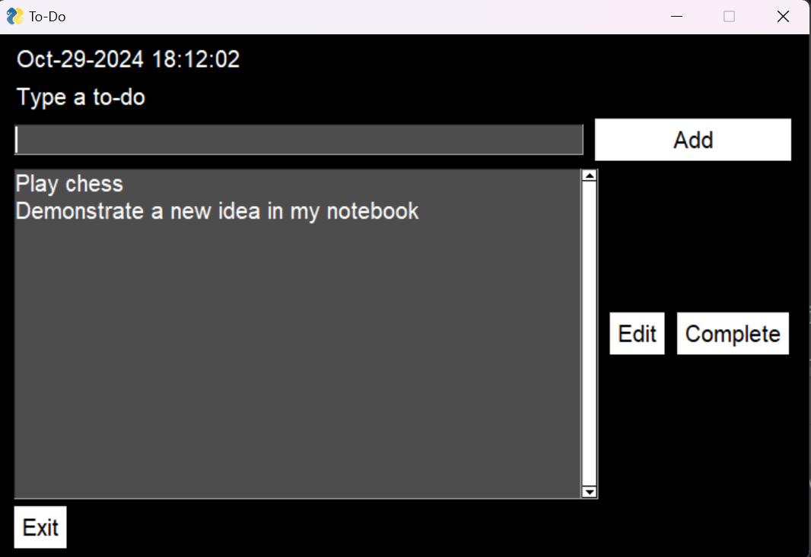
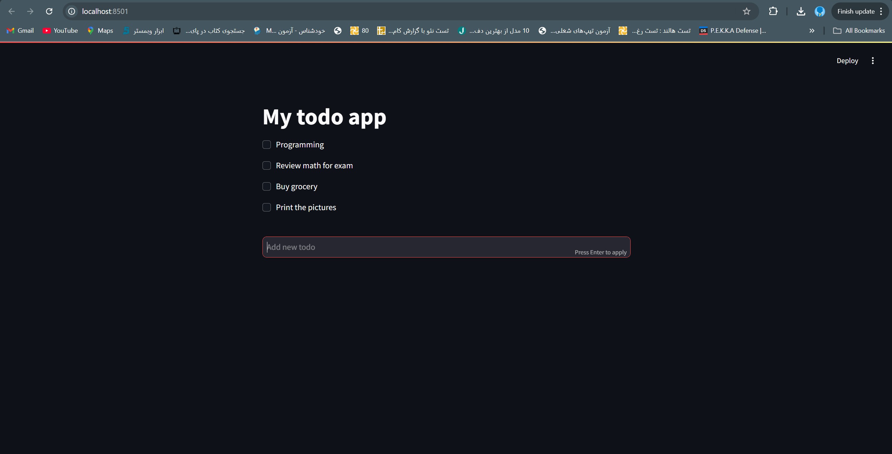

# To-Do List Application

This is a multi-version To-Do List application, featuring a **Console Version**, a **Desktop GUI Version**, and a **Web Version**. Each version allows you to add, edit, and mark tasks as complete. This project demonstrates various approaches for building a To-Do List application using different libraries suitable for console, desktop, and web environments.

## Features
- **Add Tasks:** Easily add new tasks to your to-do list in any of the three versions.
- **Edit Tasks:** Modify existing tasks to update descriptions or due dates.
- **Complete Tasks:** Mark tasks as complete and track your progress.
- **Multiple Interfaces:** Access the application via command-line, desktop, or web browser.

## Project Versions and Libraries

### 1. Console Version
This is a command-line interface (CLI) version built using basic Python functions and the `time` library. 
- **`time` library**: Used to log and track task timings, such as due dates and completion times.
- **Features**: Minimalistic and quick, this version is perfect for terminal-based task management.

### 2. Desktop GUI Version
A graphical interface version built using the `PySimpleGUI`, `time`, and `os` libraries.
- **`PySimpleGUI`**: Provides a simple way to create interactive graphical user interfaces. It's lightweight, making it suitable for quick desktop applications.
- **`time` library**: Similar to the console version, it’s used here for managing task-related timings.
- **`os` library**: Helps with file management for storing tasks locally and handling file-based operations.
- **Features**: This version allows users to interact through a friendly GUI and is ideal for desktop use.

### Desktop Version Tutorial



### 3. Web Version
An online version built using the `Streamlit` library, making the app accessible via a web browser.
- **`Streamlit`**: A Python library for building and sharing web apps quickly and interactively. It’s designed to be user-friendly, focusing on turning data scripts into web applications effortlessly.
- **Features**: The web version allows remote access and easy deployment for task management from anywhere with internet access.

### Web Version Tutorial



## Getting Started

To run the different versions, clone this repository and install the necessary dependencies using `pip`:

```bash
git clone <https://github.com/Seyed0Mohammad0Hosseini/Todo-list.git>
cd todo-list
```
## Run Console Version:
```bash
python cli.py
```
## Run Desktop Version
```bash
pip install PySimpleGUI
python gui.py
```
## Run Web Version
```bash
pip install streamlit
streamlit web.py
```

### Notes
Actually, I wrote some basics tips which relavant to python basic. 
I hope this is useful for you :)
